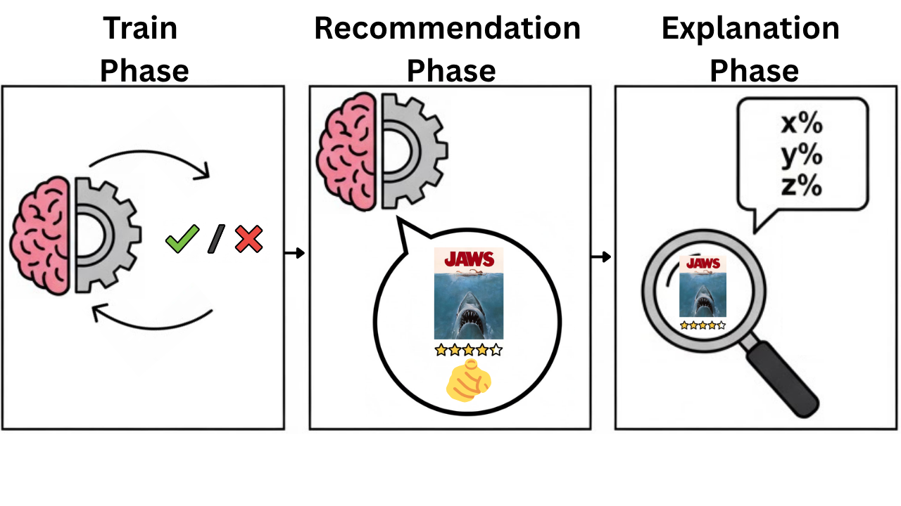

<!-- # Project title and author info provided in ReadMe.md -->
# Explainable Movie Recommendations: A PPO-Trained Movie Recommender System with LIME and SHAP Explanations
Logan Wong

law3082@g.rit.edu


<!-- A meaningful project figure (e.g., the framework of the method, key exp results visualization, etc) provided in ReadMe.md -->
# Project Figure
<p align="center">
  
</p>

<!-- Clear instructions for running the project, including, yet not limited to,  1) environment/dependency installation, 2) data preparation (e.g., how to download, data cleaning, pre-processing, etc.), and 3) training/testing demo scripts.  -->
# Instructions

## Dependency Installations
```
pip install gymnasium stable-baselines3 tensorboard pyngrok port_for lime shap
```
## Data Preparation

### Download
Download MovieLens 1M dataset, ml-1m, from https://grouplens.org/datasets/movielens/

### Data Cleaning
No data cleaning was necessary.

### Pre-processing
Inside the scripts folder:
1. Run baseline_PMF_Embeddings.ipynb
2. Run baseline_data_splitting.ipynb

In baseline_PMF_Embeddings.ipynb, data is embedded using Probability Matrix Factorization (PMF).

In baseline_data_splitting.ipynb, Movie Ratings are grouped by user ID and sorted chronologically. The first 80% of each user's ratings are for training, the rest for testing. For hyperparameter tuning, the train set is further split into 80% train and 20% valid. So hyperparametr turning uses 64% train, 16% valid, and 20% test, but after the best hyperparameters are found, they're used to train a model on the original full 80% train set before evaluating on the test set.

The test set is filtered to contain only evaluable users: a user who has at least 5 postively rated movies (a postiive rating is 4 or 5 stars) in the training set, and at least 1 positively rated movie in the test set.


## Training
Inside the notebook folder:

To train the baseline:
1. Run baseline_DDPG.ipynb

---

To train the PPO model:
1. Run PPO_HP_Tuning.ipynb
2. Run PPO.ipynb

---

To see the training curves in tensorboard, in baseline_DDPG.ipynb, PPO_HP_Tuning.ipynb and PPO.ipynb, there's a cell that outputs a SSH command.

1. Copy the SSH command that looks like this:
   ```bash
   ssh -L <PORT>:localhost:<PORT> <user>@narnia.gccis.rit.edu
   ```

2. Run this SSH command in a new local terminal

3. Then in the Notbook, you can click the link, `http://localhost:<PORT>`, to open a new tab to view TensorBoard.


## Testing
Inside the notebook folder:

To evaluate the baseline:
1. Run baseline_DDPG_Eval.ipynb
2. Run baseline_DDPG_LIME_Explanations.ipynb
3. Run baseline_DDPG_SHAP_Explanations.ipynb

--- 

To evaluate the model:
1. Run eval_PPO.ipynb
2. Run PPO_LIME.ipynb
3. Run PPO_SHAP.ipynb

## Ablation Studies

Ablations were performed on changing the values of the History length, n_history, and th episode cutoff, T_max:
n_history: (1, 3, 5, 7, 10) <br>
T_max: (50, 500, 1000, 1500) <br>

Inside the notebook folder:
1. Run Ablation_Studies_PPO.ipynb
2. Run eval_Ablation_Studies_PPO.ipynb

<!-- Key project results provided in tables/figures/charts.  -->
# Results
## Paper's Baselines and Results vs. my Baselines and my results:
| Metric | DRR Paper DRR-Ave | MY DRR-Ave Baseline | My BEST PPO (500k)
|--------|------------------|--------------------|--------------------|
| Precision@5  | 0.6025 | 0.6588 | 0.6829 |
| Precision@10 | 0.5448 | 0.5868 | 0.6017 |
| NDCG@5       | 0.6320 | 0.6981 | 0.7273 | 
| NDCG@10      | 0.8980 | 0.6753 | 0.7554 | 

## Ablation Study Results:

| Metric | PPO (2M timesteps) | PPO (1M) | PPO (750K) | Best Ablation Study 1 (n_history=1, T_max=1) | Best Ablation Study 17 (n_history=10, T_max=10) | Worst Ablation Study 7 (n_history=3, T_max=10) |
|--------|------------------------|-------------------|-------------------|------------------|--------------------|--------------------|
| Precision@5  | 0.6632 | 0.6690 | 0.6730 | 0.6882 | 0.6898 | 0.6645 |
| Precision@10 | 0.5886 | 0.5933 | 0.5962 | 0.6073 | 0.6129 | 0.5929 |
| NDCG@5       | 0.7042 | 0.7090 | 0.7138 | 0.7333 | 0.7238 | 0.7029 |
| NDCG@10      | 0.7368 | 0.7407 | 0.7450 | 0.7616 | 0.7524 | 0.7381 |

---
I generated LIME and SHAP explanations for 5 arbitrarily chosen Users: 1, 3, 7, 67, and 316.
Each recommended movie is "explained" by which 5 past positively rated movies impacted the model's decision the most. Essentially, "because you liked these 5 movies, you may like this unseen movie".

Including tables for all 5 users will be very long, so I'll only show LIME and SHAP explations for User 316. PPO_LIME.ipynb and PPO_SHAP.ipynb contain explanations for all 5 users.

## User 316's Recommendations & Actual Ratings

| Step | Movie Title | Rating |
|------|-------------|--------|
| 1 | Fly, The (1958) | 3.0 |
| 2 | Moonraker (1979) | 4.0 |
| 3 | Stepford Wives, The (1975) | 4.0 |
| 4 | Parasite (1982) | 2.0 |
| 5 | 2010 (1984) | 4.0 |
| 6 | Cube (1997) | 4.0 |
| 7 | Alien³ (1992) | 4.0 |
| 8 | Star Trek V: The Final Frontier (1989) | 5.0 |
| 9 | Star Trek: The Motion Picture (1979) | 5.0 |
| 10 | Back to the Future Part III (1990) | 4.0 |

## LIME Explanations for User 316:
### Step 1: Recommended Fly, The (1958) — Rating: 3.0

| Movie in History | Rating | Weight | Influence |
|------------------|--------|--------|-----------|
| Adventures of Buckaroo Bonzai Across the 8th Dimension, The (1984) | 5.0 | 0.06 | + |
| Deep Impact (1998) | 4.0 | 0.04 | + |
| Flight of the Navigator (1986) | 5.0 | 0.01 | + |
| Star Trek: Insurrection (1998) | 5.0 | -0.01 | - |
| Tron (1982) | 5.0 | -0.08 | - |

### Step 2: Recommended Moonraker (1979) — Rating: 4.0

| Movie in History | Rating | Weight | Influence |
|------------------|--------|--------|-----------|
| Star Trek: Insurrection (1998) | 5.0 | 0.06 | + |
| Tron (1982) | 5.0 | 0.04 | + |
| Deep Impact (1998) | 4.0 | 0.03 | + |
| Flight of the Navigator (1986) | 5.0 | -0.02 | - |
| Adventures of Buckaroo Bonzai Across the 8th Dimension, The (1984) | 5.0 | -0.03 | - |

### Step 3: Recommended Stepford Wives, The (1975) — Rating: 4.0

| Movie in History | Rating | Weight | Influence |
|------------------|--------|--------|-----------|
| Adventures of Buckaroo Bonzai Across the 8th Dimension, The (1984) | 5.0 | 0.12 | + |
| Tron (1982) | 5.0 | 0.11 | + |
| Flight of the Navigator (1986) | 5.0 | 0.09 | + |
| Star Trek: Insurrection (1998) | 5.0 | -0.06 | - |
| Moonraker (1979) | 4.0 | -0.15 | - |

### Step 4: Recommended Parasite (1982) — Rating: 2.0

| Movie in History | Rating | Weight | Influence |
|------------------|--------|--------|-----------|
| Stepford Wives, The (1975) | 4.0 | 0.38 | + |
| Moonraker (1979) | 4.0 | -0.02 | - |
| Star Trek: Insurrection (1998) | 5.0 | -0.06 | - |
| Flight of the Navigator (1986) | 5.0 | -0.08 | - |
| Adventures of Buckaroo Bonzai Across the 8th Dimension, The (1984) | 5.0 | -0.14 | - |

### Step 5: Recommended 2010 (1984) — Rating: 4.0

| Movie in History | Rating | Weight | Influence |
|------------------|--------|--------|-----------|
| Star Trek: Insurrection (1998) | 5.0 | 0.07 | + |
| Flight of the Navigator (1986) | 5.0 | 0.06 | + |
| Stepford Wives, The (1975) | 4.0 | 0.06 | + |
| Adventures of Buckaroo Bonzai Across the 8th Dimension, The (1984) | 5.0 | -0.02 | - |
| Moonraker (1979) | 4.0 | -0.11 | - |

### Step 6: Recommended Cube (1997) — Rating: 4.0

| Movie in History | Rating | Weight | Influence |
|------------------|--------|--------|-----------|
| 2010 (1984) | 4.0 | 0.13 | + |
| Moonraker (1979) | 4.0 | 0.04 | + |
| Flight of the Navigator (1986) | 5.0 | 0.01 | + |
| Star Trek: Insurrection (1998) | 5.0 | -0.06 | - |
| Stepford Wives, The (1975) | 4.0 | -0.14 | - |

### Step 7: Recommended Alien³ (1992) — Rating: 4.0

| Movie in History | Rating | Weight | Influence |
|------------------|--------|--------|-----------|
| Flight of the Navigator (1986) | 5.0 | 0.30 | + |
| Cube (1997) | 4.0 | 0.04 | + |
| 2010 (1984) | 4.0 | -0.06 | - |
| Stepford Wives, The (1975) | 4.0 | -0.16 | - |
| Moonraker (1979) | 4.0 | -0.26 | - |

### Step 8: Recommended Star Trek V: The Final Frontier (1989) — Rating: 5.0

| Movie in History | Rating | Weight | Influence |
|------------------|--------|--------|-----------|
| Cube (1997) | 4.0 | 0.12 | + |
| Alien³ (1992) | 4.0 | 0.07 | + |
| 2010 (1984) | 4.0 | 0.04 | + |
| Stepford Wives, The (1975) | 4.0 | -0.07 | - |
| Moonraker (1979) | 4.0 | -0.07 | - |

### Step 9: Recommended Star Trek: The Motion Picture (1979) — Rating: 5.0

| Movie in History | Rating | Weight | Influence |
|------------------|--------|--------|-----------|
| Cube (1997) | 4.0 | 0.19 | + |
| Alien³ (1992) | 4.0 | 0.14 | + |
| Star Trek V: The Final Frontier (1989) | 5.0 | 0.02 | + |
| 2010 (1984) | 4.0 | -0.01 | - |
| Stepford Wives, The (1975) | 4.0 | -0.27 | - |

### Step 10: Recommended Back to the Future Part III (1990) — Rating: 4.0

| Movie in History | Rating | Weight | Influence |
|------------------|--------|--------|-----------|
| Cube (1997) | 4.0 | 0.34 | + |
| Star Trek: The Motion Picture (1979) | 5.0 | 0.05 | + |
| Alien³ (1992) | 4.0 | -0.05 | - |
| 2010 (1984) | 4.0 | -0.12 | - |
| Star Trek V: The Final Frontier (1989) | 5.0 | -0.20 | - |

## SHAP Explanations for User 316:
### Step 1: Recommended Fly, The (1958) — Rating: 3.0

| Movie in History | Rating | Weight | Influence |
|------------------|--------|--------|-----------|
| Deep Impact (1998) | 4.0 | 0.02 | + |
| Adventures of Buckaroo Bonzai Across the 8th Dimension, The (1984) | 5.0 | 0.02 | + |
| Star Trek: Insurrection (1998) | 5.0 | -0.00 | - |
| Flight of the Navigator (1986) | 5.0 | 0.00 | + |
| Tron (1982) | 5.0 | -0.03 | - |

### Step 2: Recommended Moonraker (1979) — Rating: 4.0

| Movie in History | Rating | Weight | Influence |
|------------------|--------|--------|-----------|
| Star Trek: Insurrection (1998) | 5.0 | 0.02 | + |
| Deep Impact (1998) | 4.0 | 0.01 | + |
| Tron (1982) | 5.0 | 0.01 | + |
| Adventures of Buckaroo Bonzai Across the 8th Dimension, The (1984) | 5.0 | -0.01 | - |
| Flight of the Navigator (1986) | 5.0 | -0.01 | - |

### Step 3: Recommended Stepford Wives, The (1975) — Rating: 4.0

| Movie in History | Rating | Weight | Influence |
|------------------|--------|--------|-----------|
| Adventures of Buckaroo Bonzai Across the 8th Dimension, The (1984) | 5.0 | 0.04 | + |
| Tron (1982) | 5.0 | 0.03 | + |
| Flight of the Navigator (1986) | 5.0 | 0.03 | + |
| Deep Impact (1998) | 4.0 | -0.01 | - |
| Star Trek: Insurrection (1998) | 5.0 | -0.02 | - |

### Step 4: Recommended Parasite (1982) — Rating: 2.0

| Movie in History | Rating | Weight | Influence |
|------------------|--------|--------|-----------|
| Stepford Wives, The (1975) | 4.0 | 0.08 | + |
| Deep Impact (1998) | 4.0 | 0.02 | + |
| Tron (1982) | 5.0 | 0.00 | + |
| Star Trek: Insurrection (1998) | 5.0 | -0.02 | - |
| Flight of the Navigator (1986) | 5.0 | -0.02 | - |

### Step 5: Recommended 2010 (1984) — Rating: 4.0

| Movie in History | Rating | Weight | Influence |
|------------------|--------|--------|-----------|
| Flight of the Navigator (1986) | 5.0 | 0.02 | + |
| Stepford Wives, The (1975) | 4.0 | 0.02 | + |
| Tron (1982) | 5.0 | 0.01 | + |
| Star Trek: Insurrection (1998) | 5.0 | 0.01 | + |
| Adventures of Buckaroo Bonzai Across the 8th Dimension, The (1984) | 5.0 | -0.00 | - |

### Step 6: Recommended Cube (1997) — Rating: 4.0

| Movie in History | Rating | Weight | Influence |
|------------------|--------|--------|-----------|
| Tron (1982) | 5.0 | 0.03 | + |
| 2010 (1984) | 4.0 | 0.03 | + |
| Adventures of Buckaroo Bonzai Across the 8th Dimension, The (1984) | 5.0 | 0.01 | + |
| Moonraker (1979) | 4.0 | 0.00 | + |
| Flight of the Navigator (1986) | 5.0 | -0.01 | - |

### Step 7: Recommended Alien³ (1992) — Rating: 4.0

| Movie in History | Rating | Weight | Influence |
|------------------|--------|--------|-----------|
| Flight of the Navigator (1986) | 5.0 | 0.06 | + |
| Adventures of Buckaroo Bonzai Across the 8th Dimension, The (1984) | 5.0 | 0.05 | + |
| Cube (1997) | 4.0 | 0.01 | + |
| Star Trek: Insurrection (1998) | 5.0 | -0.00 | - |
| Deep Impact (1998) | 4.0 | -0.01 | - |

### Step 8: Recommended Star Trek V: The Final Frontier (1989) — Rating: 5.0

| Movie in History | Rating | Weight | Influence |
|------------------|--------|--------|-----------|
| Tron (1982) | 5.0 | 0.03 | + |
| Cube (1997) | 4.0 | 0.02 | + |
| Adventures of Buckaroo Bonzai Across the 8th Dimension, The (1984) | 5.0 | 0.01 | + |
| 2010 (1984) | 4.0 | 0.01 | + |
| Alien³ (1992) | 4.0 | 0.01 | + |

### Step 9: Recommended Star Trek: The Motion Picture (1979) — Rating: 5.0

| Movie in History | Rating | Weight | Influence |
|------------------|--------|--------|-----------|
| Cube (1997) | 4.0 | 0.04 | + |
| Moonraker (1979) | 4.0 | 0.03 | + |
| Alien³ (1992) | 4.0 | 0.02 | + |
| Tron (1982) | 5.0 | 0.00 | + |
| Adventures of Buckaroo Bonzai Across the 8th Dimension, The (1984) | 5.0 | -0.00 | - |

### Step 10: Recommended Back to the Future Part III (1990) — Rating: 4.0

| Movie in History | Rating | Weight | Influence |
|------------------|--------|--------|-----------|
| Cube (1997) | 4.0 | 0.04 | + |
| Adventures of Buckaroo Bonzai Across the 8th Dimension, The (1984) | 5.0 | 0.01 | + |
| Flight of the Navigator (1986) | 5.0 | 0.01 | + |
| Moonraker (1979) | 4.0 | 0.01 | + |
| Star Trek: The Motion Picture (1979) | 5.0 | 0.01 | + |


# Directory Structure
<!-- Generated using this command:  tree -I node_modules > structure.txt -->
```
Capstone/
├── README.md
├── data/              # Contains pre-processed data to load to avoid constantly preprocessing data
│   ├── ml-1m/         # Contains the original MovieLens 1M Dataset users, movies, and ratings
│   ├── movielens_1M_pmf_raw_data.csv
│   ├── avg_train_set_movie_ratings.pkl
│   ├── movie_embeddings.npy
│   ├── user_embeddings.npy
│   ├── idx2user.pkl
│   ├── user2idx.pkl
│   ├── idx2movie.pkl
│   ├── movie2idx.pkl
│   ├── movie_id_to_title.pkl
│   ├── movie_index_to_title.pkl
│   ├── ratings_dict.pkl
│   ├── user_sequences.pkl
│   ├── user_sequences_idx.pkl
│   ├── train_sequences.pkl
│   ├── train_sequences_64.pkl
│   ├── train_sequences_idx.pkl
│   ├── train_sequences_idx_64.pkl
│   ├── valid_sequences.pkl
│   ├── valid_sequences_idx.pkl
│   ├── test_sequences.pkl
│   └── test_sequences_idx.pkl
├── figures/         # Contains images and graphs
├── models/          # Contains all trained models 
├── notebooks/       # Jupyter Notebook files to train & eval Baseline & PPO models
│   ├── baseline_DDPG.ipynb
│   ├── baseline_DDPG_Eval.ipynb
│   ├── baseline_DDPG_LIME_Explanations.ipynb
│   ├── baseline_DDPG_SHAP_Explanations.ipynb
│   ├── PPO_HP_Tuning.ipynb
│   ├── PPO.ipynb
│   ├── eval_PPO.ipynb
│   ├── PPO_LIME.ipynb
│   ├── PPO_SHAP.ipynb
│   ├── PPO_SHAP_2.ipynb
│   ├── PPO_SHAP_explanations.pkl
│   ├── PPO_SHAP_explanations_2.pkl
│   ├── Ablation_Studies_PPO.ipynb
│   ├── eval_Ablation_Studies_PPO.ipynb
│   └── see_train_curves.ipynb
├── results/
│   ├── baseline_evaluation_metrics.json
│   ├── baseline_session_trajectories.pkl
│   ├── PPO_HP_Tuning/          # Contains hyperparameter tuning tensorboard train curves
│   ├── hp_tuning_log.txt
│   ├── PPO_TB/                 # Contains PPO tensorboard train curves
│   ├── PPO_AbStudy_TB/         # Contains all ablation studies tensorboard train curves
│   ├── PPO_ablation_study_results.pkl
│   └── PPO_session_trajectories.pkl
├── scripts/
│   ├── dataset_EDA.ipynb
│   ├── view_test_set.ipynb
│   ├── baseline_PMF_Embeddings.ipynb
│   ├── baseline_data_splitting.ipynb
│   └── 2D_embeddings_plot.ipynb
```

<!-- Reference info and acknowledgment (e.g., if your code is built on another repo, you should cite and thank their work here).  -->
# Reference Info
Liu, Feng, et al. "Deep reinforcement learning based recommendation with explicit user-item interactions modeling." arXiv preprint arXiv:1810.12027 (2018).